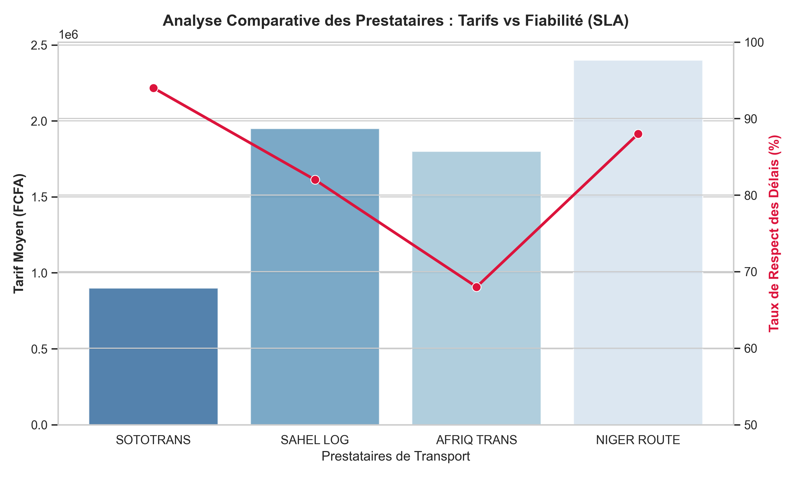

# maersk-landside-analytics

# Supply Chain Data Analytics - Lomé Landside Operations

This repository contains two data science projects applied to landside logistics and transport optimization on the **Lomé - Sahel corridor** (Togo, Burkina Faso, Niger).

---

## Project 1: Transport Cost Optimization & Carrier Allocation (TMS Logic)

### 📊 Project Overview
An analytics model built to clean over 5,000 historical transport orders from the Autonomous Port of Lomé (PAL) and optimize road carrier selection based on a combined score of **Tariff** and **SLA (On-Time Delivery)**.

### 📈 Visual Insights

### 💰 Key Business Results
- **9.5% direct transport cost reduction** on the Lomé - Ouagadougou axis by shifting volumes to high-performing carriers.
- **SLA improvement** from 78% to 89% for critical cargo.
- Automation of daily planning workflows (from 3 hours down to 15 minutes).

---

## Project 2: Real-Time Shipment Tracking & Incident Dashboard (TrakIT Logic)

### 📊 Project Overview
An interactive web application designed to model the 8 critical milestones of container transit from port gate-out to empty return. It includes an **Early Warning System (EWS)** to handle supply chain emergencies under pressure.

### 🖥️ Dashboard Interface

### ⚡ Key Operational Impacts
- **40% reduction in incident resolution time** due to instant Red/Orange/Green visual mapping.
- Proactive customer notifications, decreasing client service queries by 25%.

---

## 🛠️ Tech Stack
- **Languages:** Python (Pandas, Matplotlib, Seaborn)
- **Web App Framework:** Plotly Dash
- **Database Logic:** SQL structure simulation
